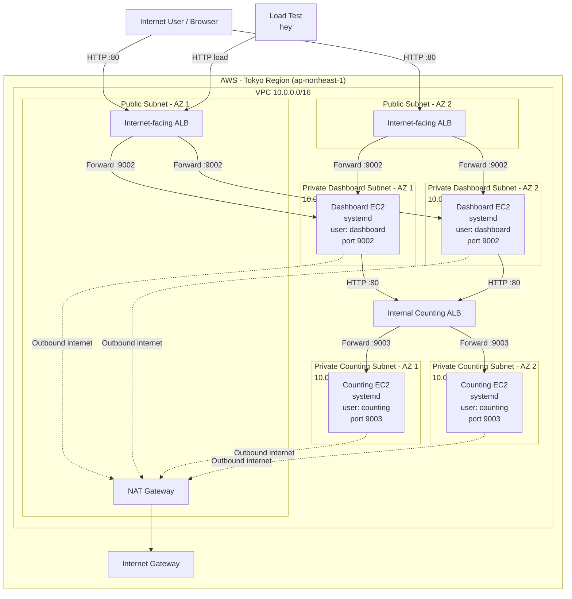

# AWS HA EC2 Architecture with ALB and Auto Scaling

## Overview

This project builds a highly available AWS application architecture using Terraform.

It is an evolution of a previous manually created public/private EC2 architecture. In this version, the infrastructure is automated with Terraform and improved with:

- Dedicated Linux service users
- `systemd` for automatic application startup and restart
- An internet-facing Application Load Balancer for the Dashboard tier
- An internal Application Load Balancer for the Counting tier
- Multi-AZ private EC2 workloads
- Auto Scaling Groups
- Target group health checks and automatic failover
- Load testing with `hey`
- Request-based Auto Scaling for the Dashboard tier

The application consists of:

- **Dashboard service** — user-facing application
- **Counting service** — private backend application

---

## Architecture Diagram



---

## High-Level Traffic Flow

### User Traffic

```text
Internet
   ↓
Internet-facing Dashboard ALB
   ↓
Dashboard EC2 instances in private subnets
   ↓
Internal Counting ALB
   ↓
Counting EC2 instances in private subnets
```

### Application Ports

| Component | Listener / App Port | Purpose |
|---|---:|---|
| Dashboard ALB | `80` | Public HTTP entry point |
| Dashboard EC2 | `9002` | Dashboard application |
| Counting ALB | `80` | Internal service endpoint |
| Counting EC2 | `9003` | Counting application |

---

## Network Design

The VPC uses:

```text
10.0.0.0/16
```

Six subnets are distributed across two Availability Zones.

| Subnet Type | CIDR |
|---|---|
| Public subnet AZ1 | `10.0.1.0/24` |
| Public subnet AZ2 | `10.0.2.0/24` |
| Private Dashboard subnet AZ1 | `10.0.11.0/24` |
| Private Dashboard subnet AZ2 | `10.0.12.0/24` |
| Private Counting subnet AZ1 | `10.0.21.0/24` |
| Private Counting subnet AZ2 | `10.0.22.0/24` |

The public subnets route Internet traffic through an Internet Gateway.

The private subnets route outbound Internet traffic through a NAT Gateway so EC2 instances can download packages and application binaries without receiving public IP addresses.

---

## Security Design

Four Security Groups separate each traffic layer.

### Public ALB Security Group

Allows:

```text
TCP 80 from 0.0.0.0/0
```

### Dashboard Security Group

Allows:

```text
TCP 9002 from Public ALB Security Group
```

The Dashboard EC2 instances are not directly exposed to the Internet.

### Internal ALB Security Group

Allows:

```text
TCP 80 from Dashboard Security Group
```

### Counting Security Group

Allows:

```text
TCP 9003 from Internal ALB Security Group
```

The Counting EC2 instances remain private and can only receive application traffic from the internal ALB.

---

## Dedicated Linux Users

The applications do not run as the default `ec2-user`.

A dedicated Linux system user is created for each application:

```text
Dashboard → dashboard
Counting  → counting
```

The users are created as non-login service accounts using:

```bash
useradd --system --no-create-home --shell /sbin/nologin <user>
```

This follows the principle of least privilege.

---

## systemd

Both applications are managed by `systemd`.

This solves a limitation in the previous architecture where the applications had to be manually restarted after an EC2 reboot or SSH session termination.

Example behavior:

```text
EC2 boots
   ↓
cloud-init runs user data
   ↓
application binary is installed
   ↓
systemd service is created
   ↓
systemctl enable --now
   ↓
application starts automatically
```

The services are also configured with:

```ini
Restart=always
RestartSec=5
```

so the process is automatically restarted if it exits unexpectedly.

---

## Launch Templates

Terraform creates separate EC2 Launch Templates for:

- Dashboard instances
- Counting instances

Each Launch Template defines:

- Amazon Linux 2023 AMI
- `t3.micro` instance type
- Security Group
- EC2 user data
- Application installation and `systemd` configuration

The latest Amazon Linux 2023 AMI is discovered dynamically with a Terraform data source instead of hardcoding an AMI ID.

---

## Auto Scaling Groups

Two Auto Scaling Groups manage the application tiers.

### Dashboard ASG

```text
Min:     2
Desired: 2
Max:     4
```

### Counting ASG

```text
Min:     2
Desired: 2
Max:     4
```

Each ASG spans two Availability Zones.

The ASGs use ELB health checks so instances with unhealthy applications can be replaced automatically.

---

## Load Balancing and Failover

### Dashboard Tier

The internet-facing ALB distributes incoming requests across healthy Dashboard instances.

If one Dashboard instance becomes unhealthy, the ALB stops sending traffic to it.

### Counting Tier

The internal ALB distributes Dashboard requests across healthy Counting instances.

The Dashboard does not point directly to a Counting EC2 private IP.

Instead, the application uses the internal ALB DNS name as its upstream endpoint:

```text
COUNTING_SERVICE_URL=http://<INTERNAL_COUNTING_ALB_DNS>
```

This allows Counting instances to be replaced without changing the Dashboard configuration.

---

## Failover Test

A Counting EC2 instance was intentionally terminated.

Expected behavior:

```text
Counting instance terminated
        ↓
Target becomes unhealthy / draining
        ↓
Internal ALB routes traffic to remaining healthy target
        ↓
Auto Scaling Group detects missing capacity
        ↓
Replacement EC2 instance is launched
        ↓
user_data configures the application
        ↓
systemd starts the Counting service
        ↓
Target becomes healthy
        ↓
Desired capacity returns to 2
```

The Dashboard remained available during the test.

---

## Load Testing

Load testing was performed from the local Mac using `hey`.

Example:

```bash
hey -z 5m -c 100 http://$(terraform output -raw dashboard_alb_dns_name)/
```

The initial CPU-based Auto Scaling policy did not scale out because the Dashboard application remained CPU-light even under high request volume.

This demonstrated an important lesson:

> High request volume does not necessarily mean high CPU utilization.

---

## Request-Based Auto Scaling

The Dashboard scaling policy was changed to use:

```text
ALBRequestCountPerTarget
```

instead of average CPU utilization.

Terraform configuration:

```hcl
resource "aws_autoscaling_policy" "dashboard_requests" {
  name                   = "dashboard-request-target"
  autoscaling_group_name = aws_autoscaling_group.dashboard.name
  policy_type            = "TargetTrackingScaling"

  target_tracking_configuration {
    predefined_metric_specification {
      predefined_metric_type = "ALBRequestCountPerTarget"
      resource_label         = "${aws_lb.dashboard.arn_suffix}/${aws_lb_target_group.dashboard.arn_suffix}"
    }

    target_value = 1000
  }
}
```

During load testing, the Dashboard ASG successfully scaled from:

```text
2 instances
↓
4 instances
```

This confirmed that the request-based scaling policy worked as expected.

---

## Bootstrap Troubleshooting

During the first deployment, both target groups became unhealthy.

The EC2 system logs showed:

```text
curl-minimal conflicts with curl
```

The original user-data script contained:

```bash
dnf install -y unzip curl
```

Amazon Linux 2023 already includes `curl-minimal`, which provides the `curl` command.

Installing the full `curl` package caused a package conflict, and because the script used `set -e`, the entire bootstrap script stopped.

The fix was:

```bash
dnf install -y unzip
```

while continuing to use the existing `curl` executable.

After updating the Launch Templates and replacing the unhealthy instances, both target groups became healthy and the application worked successfully.

This demonstrated that:

```text
Terraform apply successful
!=
Application bootstrap successful
```

Infrastructure provisioning and application health must be verified separately.

---

## Terraform Project Structure

```text
aws-ha-ec2-alb-autoscaling/
├── README.md
├── .gitignore
├── versions.tf
├── providers.tf
├── variables.tf
├── terraform.tfvars
├── network.tf
├── security-groups.tf
├── alb.tf
├── launch-templates.tf
├── autoscaling.tf
├── outputs.tf
└── user-data/
    ├── dashboard.sh
    └── counting.sh
```

`terraform.tfvars` is excluded from Git through `.gitignore`.

---

## Terraform Workflow

Initialize:

```bash
terraform init
```

Format:

```bash
terraform fmt
```

Validate:

```bash
terraform validate
```

Preview:

```bash
terraform plan
```

Apply:

```bash
terraform apply
```

Destroy:

```bash
terraform destroy
```

The environment can be safely destroyed and recreated using the same Terraform configuration, enabling repeatable infrastructure deployment.

---

## Useful Outputs

The project outputs useful infrastructure information such as:

```text
dashboard_alb_dns_name
counting_alb_dns_name
dashboard_asg_name
counting_asg_name
dashboard_target_group_arn
counting_target_group_arn
vpc_id
vpc_cidr
```

To retrieve the Dashboard endpoint:

```bash
terraform output -raw dashboard_alb_dns_name
```

---

## Architecture Perspectives

| Perspective | Implementation |
|---|---|
| **Compute** | EC2 instances managed by Auto Scaling Groups |
| **Network** | VPC, 6 subnets, Internet Gateway, NAT Gateway, route tables, multi-AZ design |
| **Storage** | EC2 root EBS volumes |
| **Security** | Layered Security Groups between Internet, ALBs, Dashboard, and Counting |
| **Identity** | Stable service endpoints through ALB DNS names; dedicated Linux service users |
| **Application Traffic** | Internet → Dashboard ALB → Dashboard → Counting ALB → Counting |
| **Management / Operations** | Terraform, EC2 user data, systemd, CloudWatch metrics, ASG health checks |

---

## Key Learnings

Through this project, I learned:

- How to evolve a manually built EC2 architecture into Infrastructure as Code
- Why application EC2 instances should remain private behind an internet-facing ALB
- The difference between internet-facing and internal load balancers
- How ALB target groups perform health checks
- How an ASG replaces unhealthy instances
- How to distribute workloads across multiple Availability Zones
- How `systemd` automatically manages application processes
- Why applications should run under dedicated service users
- Why a stable load-balancer endpoint is better than hardcoding instance IP addresses
- How user-data failures can make healthy infrastructure run unhealthy applications
- How load testing can validate Auto Scaling behavior
- Why choosing the correct scaling metric matters
- How request-based scaling can be more appropriate than CPU scaling for lightweight web applications
- How Terraform allows the full environment to be recreated and destroyed consistently

---

## Future Improvements

Possible improvements include:

- HTTPS with AWS Certificate Manager
- Route 53 DNS
- One NAT Gateway per Availability Zone for higher NAT availability
- AWS Systems Manager Session Manager for private-instance administration
- Separate IAM roles for EC2 workloads
- Shared application state using DynamoDB, RDS, or ElastiCache
- Auto Scaling based on additional ALB or custom CloudWatch metrics
- Remote Terraform state using Amazon S3 with state locking
